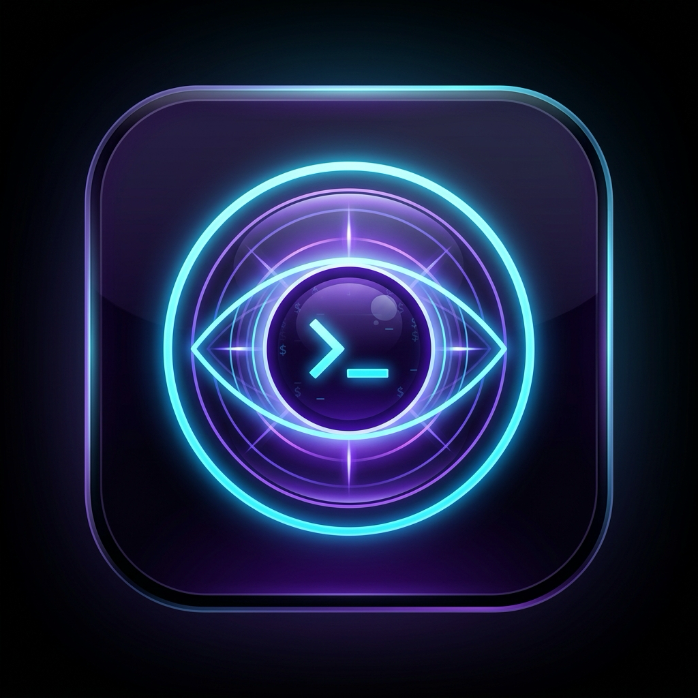

#  Theia SSH & Terminal Workbench

> **The High-Performance, Native macOS SSH Client & Terminal Engine.**  
> *Zero Subscriptions. Zero Telemetry. Zero Cloud Lock-In. 100% Free & Open-Source Forever.*

[-000000?style=flat-square&logo=apple&logoColor=white)](https://github.com)
[](https://www.rust-lang.org)
[](https://xtermjs.org)
[](https://yubico.com)
[](LICENSE)

---

## ⚡ The Anti-Freemium Manifesto: Why Theia Was Built

For decades, the **Secure Shell (SSH)** protocol has been the bedrock of Unix computing—open, robust, and free. Yet in recent years, the macOS App Store and commercial landscape have been hijacked by predatory subscription models:

- **$10 to $20/month subscriptions** just to save port forwarding rules, sync shell snippets, or open more than two tabs.
- **Forced cloud accounts** that upload your private connection labels, server endpoints, and infrastructure IPs to third-party proprietary servers.
- **Paywalled core features:** artificial limits on active sessions, locked broadcast input, and crippled SFTP transfers unless you upgrade to "Pro" or "Enterprise".
- **Bloated background telemetry:** Electron memory hogs consuming 1GB+ of RAM with analytics tracking daemons reporting your every click.

### 🛡️ The Theia Counter-Pledge

Theia was built by systems software craftsmen who had enough of the subscription rent-seeking. We believe an SSH client is a fundamental developer instrument, not a monthly bill.

1. **100% Free & Open-Source Forever (MIT):** Every single feature in Theia is available to everyone without fees, paywalls, or subscriptions.
2. **Local-First & Zero Telemetry:** Everything is stored on your machine in `~/.theia/` and macOS Keychain / Secure Enclave. There are **zero analytics pings**, **zero cloud syncs**, and **zero tracking daemons**.
3. **Hardware-Grade Security:** Native FIDO2 hardware passkey generation and authentication via **Yubico YubiKey** and **Apple Touch ID** (`ed25519-sk`), backed by AES-256-GCM encrypted vaults.
4. **Mechanical Sympathy:** Engineered with Rust zero-cost abstractions, direct POSIX process supervision, and GPU-accelerated WebGL rendering for sub-millisecond input response and minimal CPU/battery overhead.

---

## 🚀 Key Features

```
┌────────────────────────────────────────────────────────────────────────┐
│                               THEIA HUD                                │
│  ┌────────────────────────┐  ┌──────────────────────────────────────┐  │
│  │ 🖥️  GPU Terminal       │  │ 🔑 FIDO2 Touch ID & YubiKey Passkeys │  │
│  │ ⚡ WebGL Sub-ms Latency│  │ ⚡ ed25519-sk Hardware-Bound Keys    │  │
│  └────────────────────────┘  └──────────────────────────────────────┘  │
│  ┌────────────────────────┐  ┌──────────────────────────────────────┐  │
│  │ 📡 Multi-Session Bcast │  │ 🧰 1-Click SSH Server & Agent Auto   │  │
│  │ ⚡ Broadcast to All    │  │ ⚡ Instant Local Daemon & Sock Setup │  │
│  └────────────────────────┘  └──────────────────────────────────────┘  │
│  ┌────────────────────────┐  ┌──────────────────────────────────────┐  │
│  │ 📁 Dual-Pane SFTP      │  │ 📑 High-Density Keyboard Snippets    │  │
│  │ ⚡ Fast Remote Transfer│  │ ⚡ 1-Click / Enter Quick Execution   │  │
│  └────────────────────────┘  └──────────────────────────────────────┘  │
└────────────────────────────────────────────────────────────────────────┘
```

### 1. 🖥️ Native GPU-Accelerated Terminal
- **WebGL Rendering:** Powered by `@xterm/addon-webgl` for silky-smooth 120 FPS terminal redraws on ProMotion Retina displays.
- **Split Panes & Layouts:** Switch effortlessly between Single Pane, Vertical Split (`⌘D`), Horizontal Split (`⌘⇧D`), and 2x2 Grid (`⌘G`).
- **Broadcast Input Mode (`⌘B`):** Transmit keystrokes concurrently across all connected servers—perfect for multi-node rolling updates, cluster health checks, and log monitoring.
- **macOS Vibrancy:** Native translucent liquid glass design with blur backdrop filter integration.

### 2. 🔑 Hardware Security Passkeys (YubiKey & Mac Touch ID)
- **FIDO2 / U2F Hardware Keys:** Generate and manage modern `ed25519-sk` and `ecdsa-sk` cryptographic keys bound directly to physical hardware.
- **Apple Silicon Touch ID:** Authenticate SSH logins with your fingerprint using the Mac Secure Enclave.
- **Yubico YubiKey Integration:** Hardware-backed resident keys (`-O resident`) with user-verification (`-O verify-required`) and 1-click resident key extraction (`ssh-keygen -K`).
- **Automated OpenSSH Toolchain:** Auto-detects and prioritizes Homebrew OpenSSH (`/opt/homebrew/bin/ssh-keygen` and `/opt/homebrew/lib/libfido2.dylib`) over default macOS binaries lacking `libfido2`.

### 3. 🧰 1-Click Infrastructure (Server & Agent)
- **⚡ 1-Click SSH Server Auto-Config:** Auto-probes unreserved ports (starting at 2222), auto-generates host ED25519 keys, auto-imports public keys from `~/.ssh/`, resolves LAN IPs, and spawns a sandboxed `/usr/sbin/sshd` listener with live tail logs.
- **⚡ 1-Click SSH Agent Hub:** Inspects or launches `ssh-agent`, scans `~/.ssh/` for all unencrypted and hardware keys, and loads them into `$SSH_AUTH_SOCK` with zero terminal syntax required.
- **Non-Blocking POSIX Architecture:** Clean process lifecycle management with bounded `try_wait` timeouts and zero pipe hangs.

### 4. 📁 Dual-Pane SFTP File Manager
- **Side-by-Side Explorer:** Simultaneous browsing of local and remote file systems.
- **High-Throughput Transfers:** Fast upload and download queue with real-time transfer progress.
- **In-Place Permissions & Attributes:** Inspect file modes, permissions, timestamps, and symlinks.

### 5. 📑 High-Density Snippet Library
- **Keyboard-First Workflow:** Navigate snippet list with `↑` / `↓`, run immediately in active terminal with `Enter`, or broadcast to all active sessions with `⌘ Enter`.
- **Top-Mounted Execution Bar:** Instant execution cockpit at the top of the details panel.
- **Inline Editing:** Edit script commands and names in place with auto-saving.

### 6. 🌐 Port Forwarding & Tunnels
- **Local Forwarding (`-L`):** Forward remote databases and web services to your local loopback.
- **Remote Reverse Forwarding (`-R`):** Expose local web applications to remote servers.
- **Dynamic Forwarding (`-D`):** SOCKS5 proxy tunneling for encrypted network navigation.

---

## ⌨️ Essential Keyboard Shortcuts

| Shortcut | Action |
| :--- | :--- |
| `⌘ K` | **Command Palette** (Spotlight / Raycast style command search) |
| `⌘ T` | **New Local Terminal Tab** |
| `⌘ N` | **New SSH Connection Modal** |
| `⌘ W` | **Close Active Tab** |
| `⌘ 1` – `⌘ 9` | **Switch Directly to Tab 1–9** |
| `⌘ D` | **Split Pane Vertically** (Left / Right) |
| `⌘ ⇧ D` | **Split Pane Horizontally** (Top / Bottom) |
| `⌘ G` | **Split Pane 2x2 Grid** (4 Active Terminals) |
| `⌘ B` | **Toggle Multi-Session Broadcast Mode** |
| `⌘ H` | **Toggle Real-Time Telemetry HUD** |
| `⌘ /` | **Open Keyboard Shortcuts Cheat Sheet** |
| `⌘ ,` | **Preferences & Settings** |

---

## 🏗️ Architecture & Technology Stack

| Layer | Technologies |
| :--- | :--- |
| **Desktop Shell** | [Tauri v2](https://v2.tauri.app) (Rust-backed lightweight native webview) |
| **Systems Backend** | Rust 2021, `portable-pty`, `russh`, `russh-sftp`, `tokio`, `keyring` |
| **Terminal Core** | [Xterm.js 5.5](https://xtermjs.org) + WebGL GPU Addon + Fit Addon + Search Addon |
| **Frontend UI** | React 19, TypeScript 5.7, Lucide Icons, Vanilla CSS Design System |
| **Storage & Security** | Local `~/.theia/`, macOS Keychain Services, FIDO2 `libfido2` |

---

## 🛠️ Building & Development

### Prerequisites
- macOS 12+ (Apple Silicon arm64 recommended, Intel x86_64 supported)
- [Rust toolchain](https://rustup.rs/) (`rustc 1.80+` and `cargo`)
- [Node.js](https://nodejs.org/) (`v20+` or `v22+`)
- Homebrew OpenSSH (for FIDO2 hardware passkeys): `brew install openssh libfido2`

### 1. Clone & Install Dependencies
```bash
git clone https://github.com/sethchyna-ux/theia.git
cd theia
npm install
```

### 2. Run in Development Mode
```bash
npm run tauri dev
```

### 3. Build Production macOS Application & DMG
```bash
npm run build:dmg
# Produces target/release/bundle/dmg/theia_0.1.0_aarch64.dmg
```

---

## 📜 Privacy & Security Philosophy

- **No Remote Telemetry:** Theia contains no telemetry SDKs, Google Analytics, Sentry, or third-party tracking scripts.
- **No Cloud Database:** All credentials, hosts, snippets, and keys are stored in AES-encrypted local files or the native macOS Keychain.
- **Memory Safety:** Rust's borrow checker enforces compile-time safety against buffer overflows, use-after-free, and data races.
- **Hardware Isolation:** Passkeys generated with `ed25519-sk` cannot be extracted or duplicated—private keys remain in the Secure Enclave or YubiKey cryptographic chip.

---

## ⚖️ License

Distributed under the **MIT License**. Free for personal, academic, and commercial use without restriction.

*Crafted with precision for developers who respect their tools and their freedom.*
